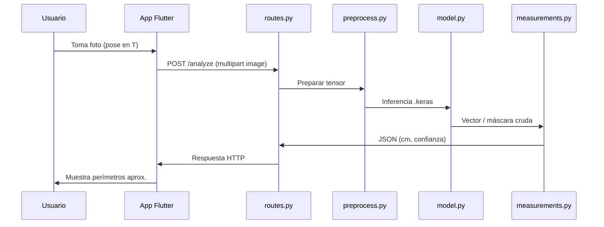

# Arquitectura del proyecto

Monorepo típico para app móvil + API:

```
cibio_anthropometry/
├── frontend/       # App Flutter (cámara + UI)
├── backend/        # API Python (FastAPI + Keras)
└── docs/           # Notas y guías
```

## Flujo de una captura



## Nota sobre PyTorch vs Keras

Tu plantilla mencionaba `model.pt` (PyTorch). En este repositorio el modelo es **TensorFlow/Keras** (`.keras`), coherente con el frontend.
